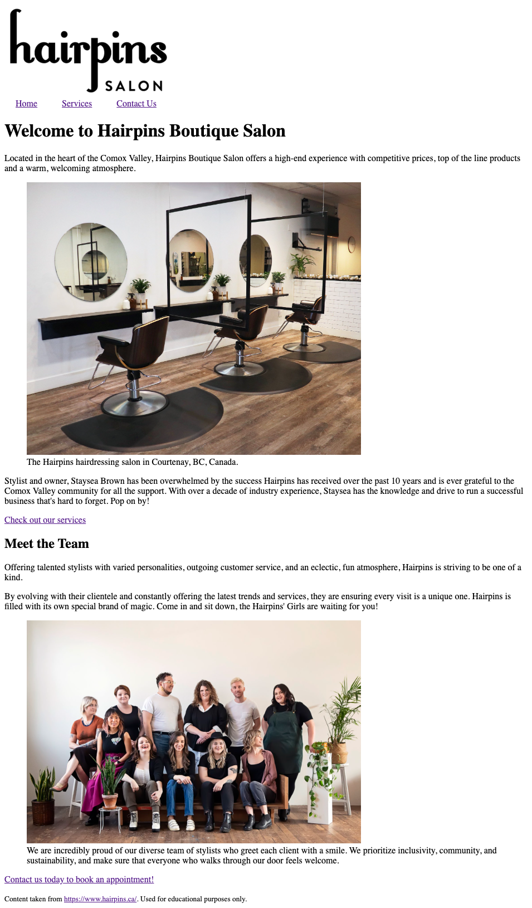

# Assignment C
This is your remote assignment C repository readme file. You are seeing this file because you have successfully accepted the assignment link and GitHub automatically created a remote repository for you.
## Objectives
You will use a local businesses’ website as inspiration to create a three-page website from scratch. Use the content provided for the three pages and structure it with HTML. You will add external CSS styles, some embedded styles and some inline styles to your website. The goal of this assignment is to choose which HTML elements are best-suited for structuring the content and practice using different types of CSS selectors.
## Instructions
Note: 
* Remember to look up how to do things in the Reference Guides and reading.
* As you work, regularly save your files and check out what your web page looks like by opening index.html in a web browser: Right-click anywhere in the file > Open in Default Browser (you need to have the “open in browser” extension installed in VS Code for this to work).
* Also remember to make regular commits to save the history of your work, that way you will be able to backtrack to a previous commit if you’ve made an error and you wish to continue with a previous version of your files.
* Read through all the instructions below before you start the assignment.
### Step 1: Get set up
* Use GitHub Desktop to clone your remote Assignment C repository onto your local machine.
* Add a comment in the head section of the index.html file including: the course code, your section number, your student name, and the assignment letter. Example:  
`<!-- DGL 103 DLU1 - Claire Guiot - Assignment C -->`
* Link each HTML page to the external stylesheet.
* Add the logo to the website’s browser tab by including this line of code in the head of each HTML page:  `<link rel="icon" type="image/x-icon" href="images/favicon.ico">` 
* Change the page titles in each HTML page so that they include the business name and describe the page’s content.
### Step 2: Structure the content
* Use various HTML elements to structure all the content on every page. Make sure that you’ve read and understood the content first. Check out the business’ website: https://www.hairpins.ca/. Your content structure must make sense from a semantic point of view and from a website visitor’s perspective. 
You will definitely need to use the elements below but you can use others too if you like:  
header, main, footer, h1, h2, p, ul, li, figure, figcaption, small 
Note: to insert a line break type ` `
* Add images where indicated in the content (always include alt text for accessibility).
* Add text links where indicated in the content. 

At this point your index page might look like this:

### Step 3: Style the content
Write the following styles in the external stylesheet:
* Change the font sizes:
  * Change the font size of all the h1 elements to 3rem. Add a comment next to this line in your CSS to tell me what is the quivalent of 3rem in pixels.
  * Set the root font size on all pages to 62.5%
  * Set the font size of the body element on all pages to 1.6rem
  * Change the font size of all the h1 elements again (without overwriting your original size change) so that the h1 are restored to the size they were after you originally changed them to 3rem.
* Choose and apply two different Google Fonts to the content on every page (you can use as many different weights as you like). 
* Change the background colour of the nav on every page. 
* Change the colour of the links in the nav on every page.
* Center all the content on every page.
* Change the background colour of the footer on every page. You can add negative space around the content in the footer by adding the declaration `padding: 40px;`
* Change the colour of the links in the footer on every page. 

Write the following styles as embedded styles:
* Only in index.html, change the background colour of the content “Time for a new do? Check out our services”. 
* Only in services.html, change the list styling to remove the bullets.

Write new styles that complete the following requirements:
* Add a style rule to your external stylesheet using an ID selector.
* Add a style rule to your external stylesheet using a class selector.
* Add a style rule to your external stylesheet using a descendant selector.
* Add one inline style rule to one of the pages.
* Use a colour name and a hexidecimal colour value.
* Add an appropriate background image (not provided) to an element on one of the pages. You can source the image from a website such as https://www.unsplash.com or https://www.pexels.com. Make sure the image is a correct file type and size. The background image should not repeat and its attachment should be fixed. You may need to use the `background-size: cover` declaration to make the background look the way you want. See https://www.w3schools.com/cssref/css3_pr_background-size.asp for more info.

Make sure that all your styles are being used by the browser to style the content. In other words, fix any conflicts caused by the cascade, specificity or inheritance.

### Step 4: Validate your work
1. Go to https://validator.w3.org/#validate_by_upload 
Choose your index.html file in your local repository and click the Check button. If there are no errors then you should see a green message that says “Document checking completed. No errors or warnings to show.” If you get an error message then troubleshoot your work until you get the green message.
Take a screenshot of your HTML validation results. 
2. Go to https://jigsaw.w3.org/css-validator/#validate_by_upload 
Choose your style.css file in your local repository and click the Check button.
If you get the green “Congratulations! No Error Found.” then take a screenshot of the screen. If not, troubleshoot your work.

### Step 5: Submit your work
Complete the following steps from the GitHub and GitHub Desktop Reference Guide:
1. Commit your changes if you’ve made changes since the last commit.
2. Push your changes to GitHub.
3. Submit your assignment in BrightSpace:
You can access the assignment submission tool by navigating to the week’s assignment in the Content Area, or by clicking on Assignments in the main menu. 
  * Click on "Assignment B Submission" and follow the provided instructions. 
  * Don’t forget to answer the questions and attach the screenshots of your final W3 HTML and CSS validation results.
4. If you have been using a lab computer at the Comox Valley Campus to do your work with GitHub Desktop, remember to shutdown or restart the computer before you leave the room, so that other students won’t have access to your repositories.

## Deadlines
Assignments must be submitted before the end of the week but they will only be graded at the end of every unit. Late assignments will not be accepted and will receive an F. You can complete and submit a contract that allows you to extend the deadline for an assignment but you must email it to your instructor a minimum of 48 hrs before the deadline. Deadline extensions are only allowed for those unplanned, unexpected emergencies that life sometimes throws at us, and they will only be approved by your instructor if you follow the correct process. See the Course Info folder in BrightSpace for more info.